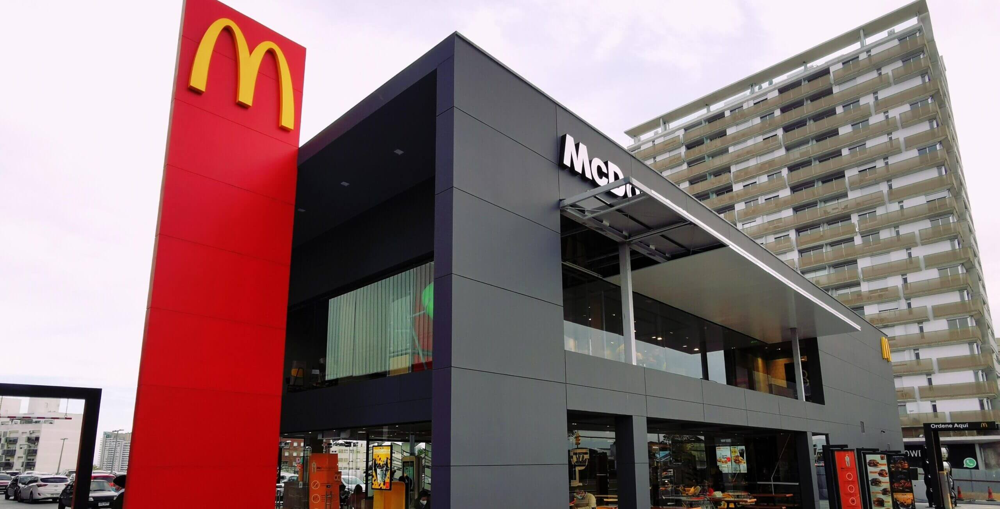

# Empresas que utilizan BPM

::: details McDonal's
 
Bpm en McDonald

McDonald´s® es una empresa de Fast-Food que controla la calidad de la comida que ofrecen desde la selección de la materia prima hasta las manos del consumidor en el producto final. Esta empresa exige a sus proveedores que cumplan estrictos requisitos de control de calidad como Buenas Prácticas de Manufactura, Control de Pestes, Plagas y Plan HACCP o Control de Puntos Críticos y Riesgos, Controles de Microbiología y Evaluaciones de características organolépticas. Cumplen con los más altos estándares de limpieza en los locales y también controlan los procedimientos de preparación de los productos, como el tiempo y la temperatura de cocción de los alimentos con el fin de garantizar a sus clientes la inocuidad y calidad de sus productos. Todas las materias primas atraviesan por diferentes análisis e inspecciones que son llevadas a cabo por el Ministerio de Ganadería, Agricultura y Pesca (MAGYP), el Instituto Nacional de carnes, departamentos bromatológicos de las Intendencias, el LATU (Laboratorio Técnico del Uruguay) y también por la misma empresa. El Big Mac por ejemplo atraviesa 24 controles de calidad antes de llegar a las manos de los consumidores. Los controles que se llevan a cabo en los alimentos sirven para detectar la presencia de contaminantes físicos, químicos y/o microbiológicos. De esta manera se realizan análisis que monitoreen si los parámetros indicadores de los procesos y productos reflejan su real estado. Todos los datos y resultados de los controles y análisis que se llevan a cabo en los alimentos se documentan y se certifican diariamente. El fin de tener toda la información posible de los alimentos, desde la materia prima hasta los consumidores, es poder garantizar la rastreabilidad o trazabilidad del producto. Por esta razón si un alimento llega a manos de los consumidores en mal estado, los jefes o superiores de McDonald’s pueden saber cuál fue el error si es que lo hubo y qué medidas tomar para que ese error no se vuelva a cometer y poder seguir garantizando la calidad e inocuidad de los productos que se comercializan. A partir del mes de abril de 2004, todos los locales de McDonald´s del país se encuentran certificados por el IRAM según la Norma 14201, que garantiza las buenas prácticas de manufactura en servicios de alimentos. McDonald´s es la única empresa de fast food que logro alcanzar los estándares de esta norma. El IRAM realizo auditorias que abarcaron desde la revisión de los procedimientos que se llevaban a cabo para elaborar la comida, hasta análisis microbiológicos de los alimentos que estaban listos para consumir. Los alcances de la Norma 14201 son: • Establecimiento de preparación, distribución y de servicios. • Requisitos de higiene del establecimiento. • Requisitos sanitarios de higiene del personal. • Requisitos de higiene en la elaboración de alimentos. • Evaluación de proveedores. • Dirección y supervisión. • Documentación y registro. • Satisfacción del cliente.

:::
<!-- ::: details Burger King -->
<!-- ::: -->
::: details Grido
 
Tras un proceso de crecimiento que tuvo su origen en la crisis del 2000, paso por varias etapas hasta convertirse en lo que es hoy una de las mayores heladerias de sudamerica. Quien podria decir que una heladeria tendria tanto exito, al principio solo se dedicaban a la venta de cucuruchos a las heladerias. Al sobreponerse a otra crisis decideron vender helados artesanales y le fue muy bien, al punto de abrir sucursales y utilizar el sistema de franquicias. "se apalancaron en incorporar tecnologia para crecer" hasta llegar a todos los rincones del pais (Argentina) "...inauguraron su propio laboratorio de calidad donde desde el ingreso de la materia prima hasta el producto terminado, cada lote es controlado mediante análisis físico-químicos y microbiológicos." (incorporacion del sistema BPM en su totalidad). Desde el 2006 traspasaron fronteras, 2006 Chile, 2012 Uruguay, 2015 Paraguay."...también se adelantó a su época y en 2010 apostó por el delivery online, cuando crearon su propia web de pedidos para estar más cerca de sus clientes." En el 2014 lanzaron su línea de alimentos congelados que arrancó con pizzas y luego fue sumando más opciones. Citado de [iprofessional](https://www.iprofesional.com/actualidad/333245-nacional-y-popular-como-grido-construyo-su-imperio-de-helado)
:::
<!-- ::: details Coca-Cola -->
<!-- ::: -->
<!-- ::: details Hornex -->
<!-- ::: -->
<!-- ::: details Pagnifique -->
<!-- ::: -->
<!-- ::: details Optimo -->
<!-- ::: -->
<!-- ::: details Bimbo -->
<!-- ::: -->
Estas empresas han implementado BPM desde su pais de origen y otras son uruguayas que han implementado el sistema de otras maneras. Se han utilizado como ejemplo del efecto que ha tenido en su trayectoria la aplicacion de estos sistemas